# Práctica 9: Servidor FTP y FTPS con Docker

## Descripción

Esta práctica implementa un servidor FTP/FTPS utilizando vsftpd en un contenedor Docker. Se configura el servidor para permitir acceso autenticado, transferencia de archivos y cifrado mediante SSL/TLS. Se analiza el tráfico de red mediante Wireshark para comparar la seguridad entre FTP tradicional y FTPS.

## Arquitectura

El proyecto utiliza Docker Compose para orquestar el servicio vsftpd basado en la imagen `fauria/vsftpd`. El contenedor opera en modo host network para facilitar la conectividad en modo pasivo. Los puertos pasivos se configuran en el rango 21000-21100 para evitar conflictos con servicios del sistema.

## Punto 1: Instalación del Entorno

Se verificó la instalación de las herramientas necesarias: Docker, Docker Compose, Wireshark y FileZilla.

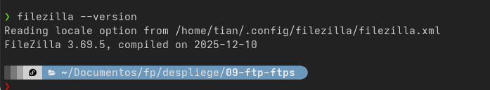

## Punto 2: Conexión Inicial con Usuario

Se estableció conexión con el usuario daw_user antes de habilitar permisos de escritura. El usuario puede navegar por el árbol de directorios pero no tiene capacidad de crear carpetas ni subir archivos.

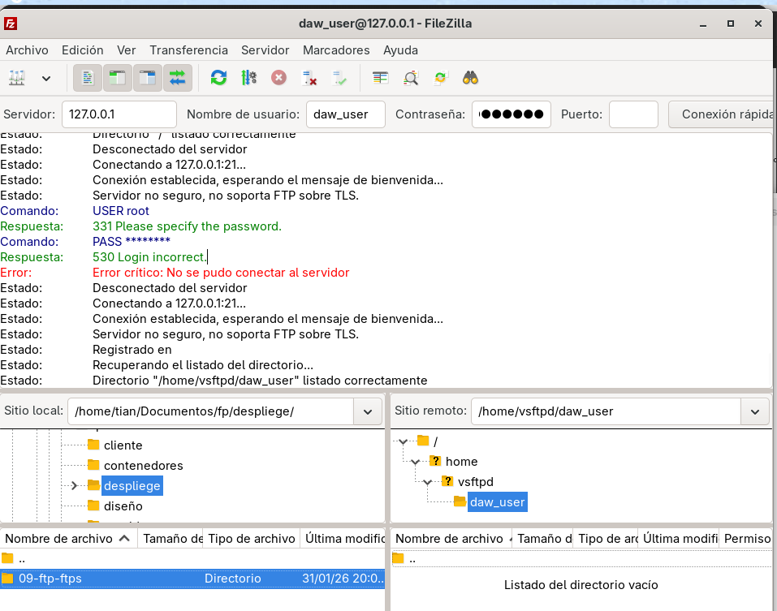

## Punto 3: Usuario sin Permisos de Escritura

Se verificó que el usuario daw_user no puede crear carpetas ni arrastrar archivos al servidor debido a la configuración inicial restrictiva.

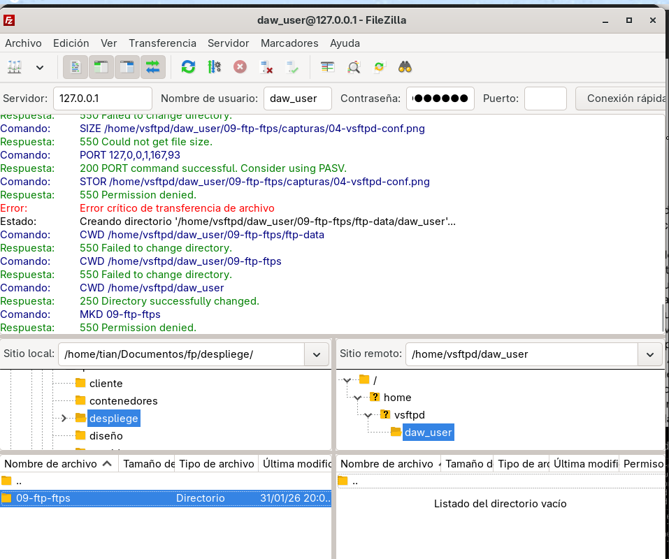

## Punto 4-6: Configuración de vsftpd

Se modificó el archivo vsftpd.conf para habilitar las siguientes funcionalidades:

- Acceso anónimo mediante `anonymous_enable=YES`
- Permisos de escritura con `write_enable=YES`
- Enjaular usuarios locales con `chroot_local_user=YES`
- Banner personalizado: "Bienvenido al servidor FTP de DAW"
- Rango de puertos pasivos: 21000-21100

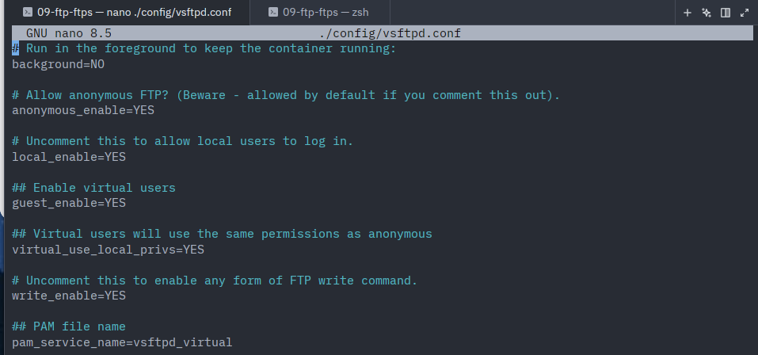

## Punto 7: Verificación de Funcionalidad

### Conexión Anónima

Se verificó que el servidor permite conexiones anónimas sin autenticación.

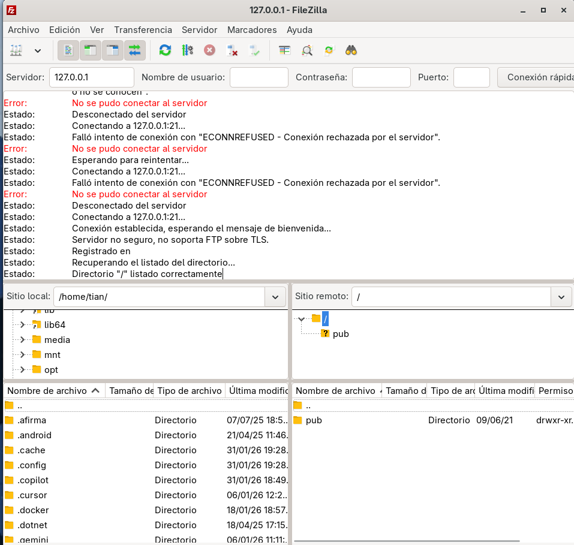

### Creación de Carpetas

Los usuarios autenticados pueden crear directorios en sus espacios asignados.

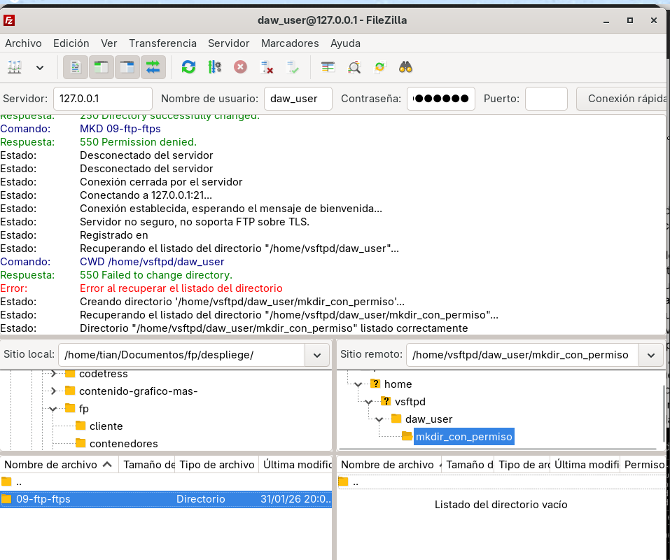

### Subida de Archivos

Los usuarios con permisos pueden transferir archivos al servidor.

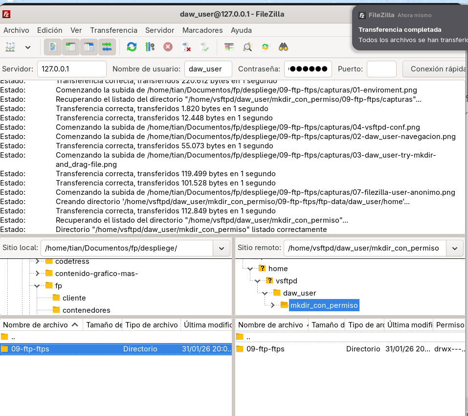

### Usuario Enjaulado

El usuario daw_user está restringido a su directorio home y no puede navegar fuera de él debido a la configuración chroot.

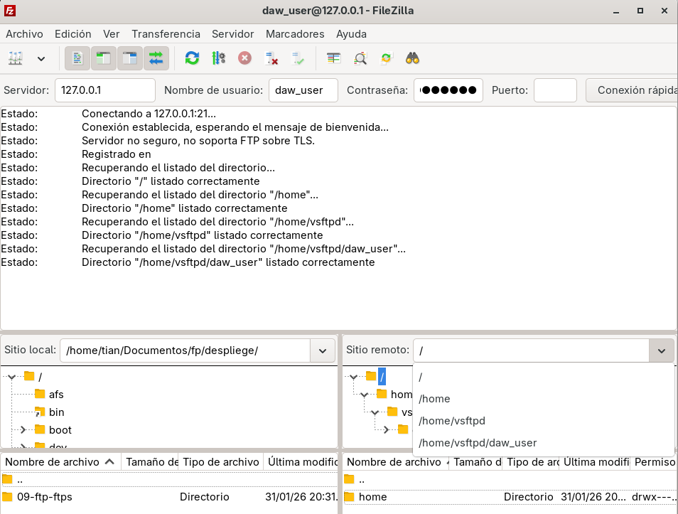

## Punto 8: Análisis de Tráfico FTP

Se capturó el tráfico FTP mediante Wireshark para identificar vulnerabilidades de seguridad.

### Credenciales en Texto Plano

El análisis reveló que las credenciales de usuario y contraseña se transmiten sin cifrado, visibles en texto plano. También se identificó el banner de bienvenida personalizado.

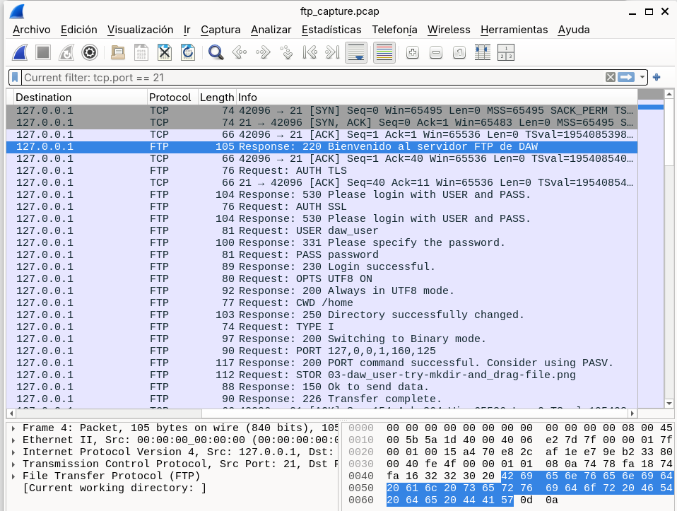

### Modo Pasivo

Se verificó el funcionamiento del modo pasivo mediante los comandos PASV y la respuesta 227 Entering Passive Mode. Los puertos asignados se encuentran en el rango configurado 21000-21100.

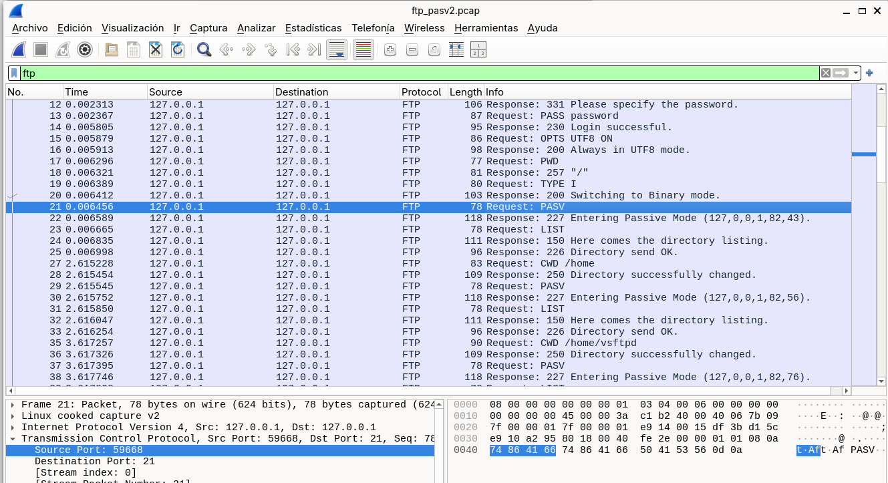

## Punto 9: Configuración FTPS

Se generó un certificado SSL autofirmado y se configuró vsftpd para soportar conexiones cifradas mediante TLS.

### Configuración SSL en vsftpd

Se añadieron las directivas SSL al archivo de configuración, incluyendo las rutas a los certificados y las políticas de cifrado.

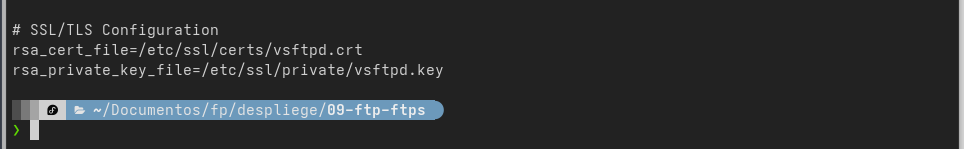

### Conexión FTPS

FileZilla se configuró para utilizar el protocolo FTPS con TLS explícito. El cliente advierte sobre el certificado autofirmado antes de establecer la conexión.

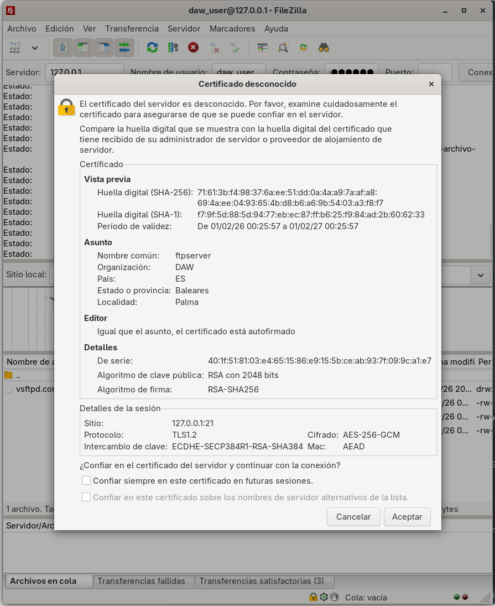

### Establecimiento de Conexión TLS

La conexión TLS se establece exitosamente, cifrando toda la comunicación posterior entre cliente y servidor.

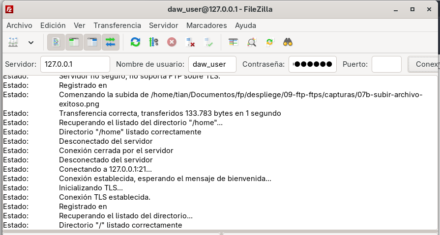

## Punto 10: Análisis de Tráfico FTPS

Se capturó el tráfico FTPS para verificar el cifrado de las comunicaciones.

### Negociación TLS

El cliente inicia la negociación TLS mediante el comando AUTH TLS. El servidor responde con el código 234 Proceed with negotiation, indicando que acepta establecer una conexión cifrada.

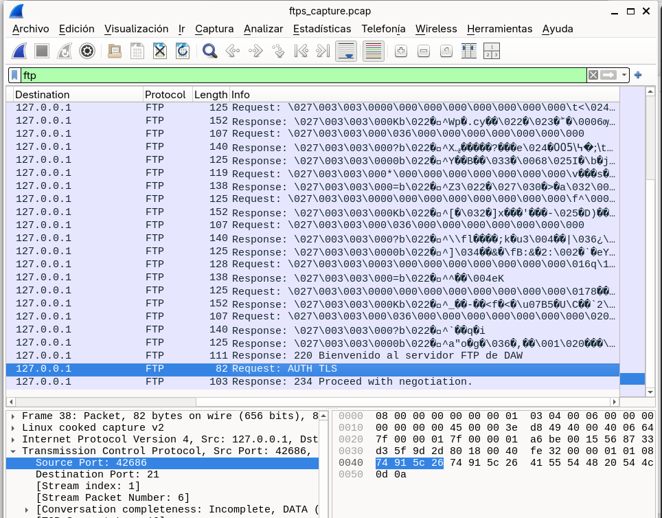

### Datos Cifrados

Una vez establecido el túnel TLS, todas las credenciales y comandos se transmiten como Application Data cifrada. A diferencia del FTP tradicional, las credenciales ya no son visibles en texto plano.

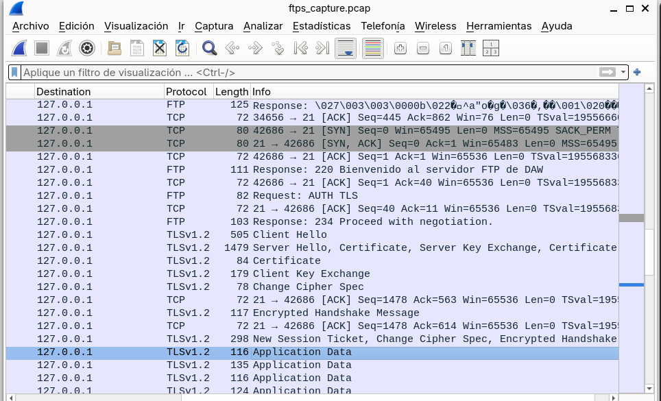

## Comparativa: FTP vs FTPS

La práctica demuestra la diferencia crítica de seguridad entre ambos protocolos:

**FTP tradicional**: Las credenciales (USER y PASS) se transmiten en texto plano, permitiendo su intercepción mediante análisis de tráfico.

**FTPS**: Tras la negociación TLS, todos los datos se cifran mediante SSL/TLS, protegiendo las credenciales y el contenido transferido de posibles ataques de interceptación.

## Adaptaciones Realizadas

El proyecto se implementó sobre Docker en lugar de una máquina virtual tradicional. Las principales adaptaciones fueron:

- Uso de contenedores Docker con la imagen fauria/vsftpd
- Configuración de network_mode host para simplificar la conectividad en modo pasivo
- Modificación del rango de puertos pasivos a 21000-21100 debido a conflictos con servicios del sistema
- Uso del usuario virtual daw_user en lugar del usuario root del sistema

## Estructura del Proyecto

```
09-ftp-ftps/
├── Dockerfile
├── compose.yaml
├── config/
│   ├── vsftpd.crt
│   └── vsftpd.key
├── ftp-data/
│   └── daw_user/
├── capturas/
│   └── [15 capturas de pantalla]
├── ftp_capture.pcap
├── ftp_pasv2.pcap
├── ftps_capture.pcap
└── README.md
```

## Conclusiones

La práctica demostró la vulnerabilidad inherente del protocolo FTP tradicional y la importancia de implementar FTPS en entornos de producción. El uso de Docker simplificó el despliegue y aislamiento del servicio, aunque requirió adaptaciones en la configuración de red para el correcto funcionamiento del modo pasivo.
